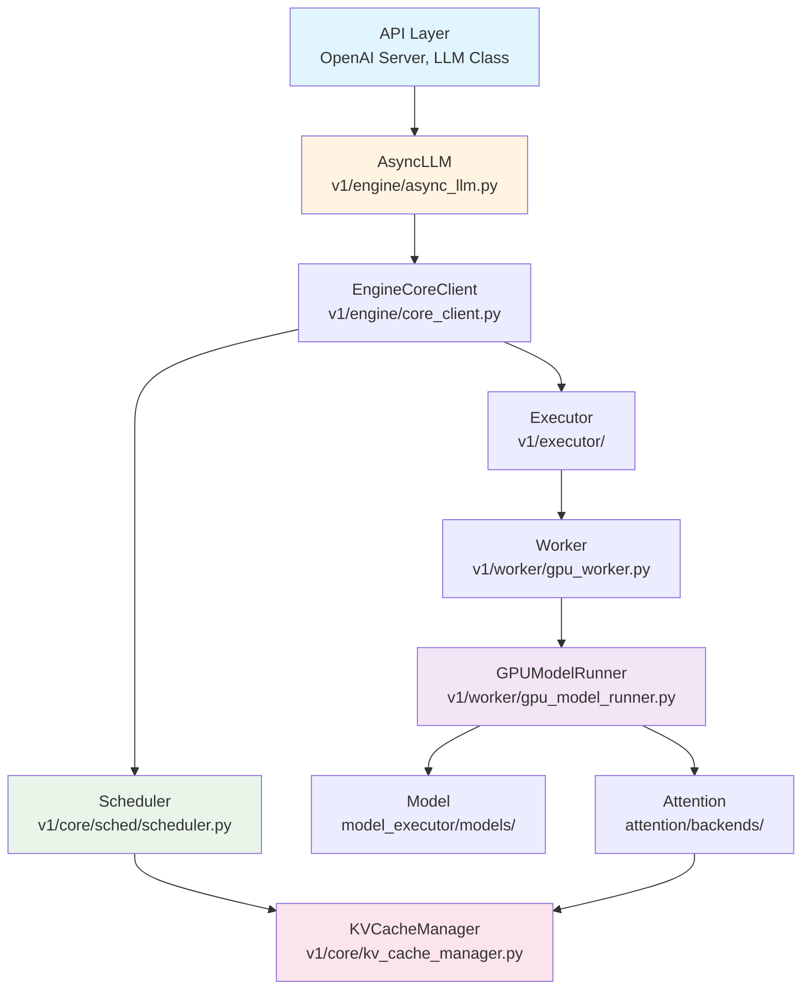

# vLLM Detailed Architecture Analysis

**Comprehensive Code Analysis and Call Flow Documentation**

---

## Table of Contents

1. [Executive Summary](#executive-summary)
2. [Architecture Overview](#architecture-overview)
3. [Core Engine Components](#core-engine-components)
4. [Scheduler Deep Dive](#scheduler-deep-dive)
5. [KV Cache Management](#kv-cache-management)
6. [Worker and Model Execution](#worker-and-model-execution)
7. [Attention Backends](#attention-backends)
8. [API Entry Points](#api-entry-points)
9. [Complete Request Flow](#complete-request-flow)
10. [Distributed Execution](#distributed-execution)
11. [Performance Optimizations](#performance-optimizations)

---

## Executive Summary

vLLM is a high-performance inference engine for Large Language Models built around several key innovations:

**Core Innovation - PagedAttention**: Dynamic block-based KV cache allocation achieving ~90% memory efficiency vs ~50% in traditional pre-allocated approaches.

**Architecture Pattern**: Five-layer design with clear separation of concerns:
```
API Layer → Engine Layer → Scheduling Layer → Execution Layer → Hardware Layer
```

**Key Components**:
- **LLMEngine**: Request orchestration and lifecycle management
- **Scheduler**: Continuous batching, memory management, and request scheduling
- **KVCacheManager**: Dynamic memory allocation with prefix caching
- **ModelRunner**: Model execution and sampling
- **Attention Backends**: Optimized attention kernels (FlashAttention, PagedAttention)

---

## Architecture Overview

### Directory Structure

```
vllm/
├── engine/              # Main engine implementation (redirects to v1/)
├── v1/                  # V1 architecture (current production)
│   ├── engine/          # LLMEngine, AsyncLLM, EngineCoreClient
│   ├── core/            # Core scheduling and KV cache management
│   │   ├── sched/       # Scheduler implementation
│   │   ├── kv_cache_*.py  # KV cache management
│   │   └── encoder_cache_manager.py
│   ├── worker/          # Worker processes and model runners
│   │   ├── gpu_model_runner.py
│   │   ├── gpu_worker.py
│   │   └── *_model_runner.py
│   ├── executor/        # Distributed execution
│   │   ├── uniproc_executor.py
│   │   ├── multiproc_executor.py
│   │   └── ray_executor.py
│   ├── attention/       # Attention backend implementations
│   └── outputs.py       # Output data structures
├── entrypoints/         # API servers and entry points
│   ├── openai/          # OpenAI-compatible API
│   ├── llm.py           # Python LLM class
│   └── cli/             # Command-line interfaces
├── attention/           # Attention implementations
│   ├── backends/        # Various attention backends
│   ├── ops/             # Attention operations
│   └── layers/          # Attention layer implementations
├── model_executor/      # Model loading and execution
├── config.py            # Configuration classes
└── distributed/         # Distributed communication primitives
```

### Component Relationships



---

## Core Engine Components

### 1. LLMEngine (v1/engine/llm_engine.py)

**Purpose**: Legacy-compatible interface for the V1 engine. Manages request lifecycle and coordinates between components.

**Key Methods**:

```python
class LLMEngine:
    def __init__(self, vllm_config: VllmConfig, executor_class, ...):
        # Lines 50-136: Initialize core components
        self.processor = Processor(vllm_config, tokenizer)  # Line 92
        self.output_processor = OutputProcessor(...)  # Line 99
        self.engine_core = EngineCoreClient.make_client(...)  # Line 108

    def add_request(self, request_id, prompt, params, ...):
        # Lines 213-275: Process and add new request
        # Handles N>1 sampling (fan-out to child requests)
        request = self.processor.process_inputs(...)  # Line 238
        self.output_processor.add_request(request, ...)  # Line 257
        self.engine_core.add_request(request)  # Line 259

    def step(self) -> list[RequestOutput]:
        # Lines 277-311: Main engine loop iteration
        outputs = self.engine_core.get_output()  # Line 285
        processed = self.output_processor.process_outputs(...)  # Line 290
        self.engine_core.abort_requests(...)  # Line 299
        return processed.request_outputs  # Line 311
```

**File Reference**: `vllm/v1/engine/llm_engine.py`

**Call Flow**:
1. `add_request()` → `Processor.process_inputs()` → `engine_core.add_request()`
2. `step()` → `engine_core.get_output()` → `output_processor.process_outputs()`

### 2. AsyncLLM (v1/engine/async_llm.py)

**Purpose**: Asynchronous engine interface for high-throughput serving. Runs engine core in separate process with async I/O.

**Key Methods**:

```python
class AsyncLLM:
    def __init__(self, vllm_config, executor_class, ...):
        # Lines 55-178: Initialize async components
        self.processor = Processor(vllm_config, tokenizer)  # Line 116
        self.output_processor = OutputProcessor(...)  # Line 123
        # Engine runs in separate process
        self.engine_core = EngineCoreClient.make_async_mp_client(...)  # Line 132

    async def generate(self, prompt, sampling_params, request_id, ...):
        # Lines 350-456: Main async generation loop
        # Start output handler if not running
        self._run_output_handler()  # Line 392

        # Add request to queue
        q = await self.add_request(...)  # Line 404

        # Stream results as they arrive
        while not finished:
            out = q.get_nowait() or await q.get()  # Line 422
            finished = out.finished
            yield out  # Line 428

    def _run_output_handler(self):
        # Lines 458-527: Background task pulling from engine
        async def output_handler():
            while True:
                outputs = await engine_core.get_output_async()  # Line 476
                processed = output_processor.process_outputs(...)  # Line 496
                await engine_core.abort_requests_async(...)  # Line 507
```

**File Reference**: `vllm/v1/engine/async_llm.py`

**Architecture**: Uses producer-consumer pattern with async queues:
- Main thread: Accepts requests, adds to engine, yields outputs
- Background task: Pulls outputs from engine, processes, pushes to request queues

---

## Scheduler Deep Dive

### Scheduler Implementation (v1/core/sched/scheduler.py)

**Purpose**: Core scheduling algorithm implementing continuous batching, memory management, and request prioritization.

**Key Data Structures**:

```python
class Scheduler:
    def __init__(self, vllm_config, kv_cache_config, ...):
        # Lines 53-187: Initialize scheduler state

        # Request tracking
        self.requests: dict[str, Request] = {}  # Line 126
        self.waiting = create_request_queue(self.policy)  # Line 135
        self.running: list[Request] = []  # Line 136
        self.finished_req_ids: set[str] = set()  # Line 142

        # KV cache management
        self.kv_cache_manager = KVCacheManager(...)  # Line 178

        # Encoder cache for multi-modal models
        self.encoder_cache_manager = EncoderCacheManager(...)  # Line 166

        # Scheduling constraints
        self.max_num_running_reqs = config.max_num_seqs  # Line 84
        self.max_num_scheduled_tokens = config.max_num_batched_tokens  # Line 85
```

**File Reference**: `vllm/v1/core/sched/scheduler.py`

### Scheduling Algorithm

The `schedule()` method (lines 189-696) implements a sophisticated scheduling algorithm:

```python
def schedule(self) -> SchedulerOutput:
    # Lines 189-696: Main scheduling logic

    # Phase 1: Schedule RUNNING requests (lines 218-363)
    req_index = 0
    while req_index < len(self.running) and token_budget > 0:
        request = self.running[req_index]

        # Calculate tokens to schedule
        num_new_tokens = (
            request.num_tokens_with_spec +
            request.num_output_placeholders -
            request.num_computed_tokens
        )  # Lines 223-227

        # Allocate KV cache blocks (line 278)
        new_blocks = self.kv_cache_manager.allocate_slots(
            request, num_new_tokens, num_lookahead_tokens
        )

        if new_blocks is None:
            # Cannot allocate - preempt lowest priority request (lines 290-321)
            if self.policy == SchedulingPolicy.PRIORITY:
                preempted_req = max(self.running,
                    key=lambda r: (r.priority, r.arrival_time))
            else:
                preempted_req = self.running.pop()

            self.kv_cache_manager.free(preempted_req)  # Line 307
            preempted_req.status = RequestStatus.PREEMPTED  # Line 309
            self.waiting.prepend_request(preempted_req)  # Line 317
```

**Scheduling Phases**:

1. **Phase 1 - Running Requests** (lines 218-363):
   - Schedule already-running requests first (decode phase)
   - Allocate KV cache for new tokens
   - Preempt if out of memory (lowest priority first)
   - Handle speculative decoding tokens

2. **Phase 2 - Waiting Requests** (lines 379-614):
   - Schedule new or preempted requests (prefill phase)
   - Check for prefix cache hits
   - Handle external KV cache (P/D disaggregation)
   - Allocate initial KV blocks
   - Chunked prefill support

```python
    # Phase 2: Schedule WAITING requests (lines 379-614)
    while self.waiting and token_budget > 0:
        request = self.waiting.peek_request()

        # Get prefix-cached blocks (lines 430-434)
        new_computed_blocks, num_cached_tokens = (
            self.kv_cache_manager.get_computed_blocks(request)
        )

        # Check external KV cache via KVConnector (lines 437-452)
        if self.connector is not None:
            ext_tokens, load_kv_async = (
                self.connector.get_num_new_matched_tokens(
                    request, num_cached_tokens
                )
            )

        # Allocate slots for new tokens (line 534)
        new_blocks = self.kv_cache_manager.allocate_slots(
            request, num_new_tokens + num_external_computed_tokens,
            num_new_local_computed_tokens, new_computed_blocks
        )

        if new_blocks is None:
            break  # Out of memory, stop scheduling

        # Move request to running queue
        self.running.append(request)  # Line 573
        request.status = RequestStatus.RUNNING  # Line 592
```

**Scheduler Output Structure**:

```python
scheduler_output = SchedulerOutput(
    scheduled_new_reqs=[...],        # New requests being prefilled
    scheduled_cached_reqs=[...],     # Running/resumed requests
    num_scheduled_tokens={...},      # req_id -> num_tokens
    total_num_scheduled_tokens=...,  # Sum of all tokens
    scheduled_spec_decode_tokens={...},  # Spec decode tokens
    scheduled_encoder_inputs={...},  # Multi-modal encoder inputs
    num_common_prefix_blocks=[...],  # For cascade attention
    finished_req_ids=...,           # Requests finished last step
)
```

### Request State Machine

```
WAITING → WAITING_FOR_REMOTE_KVS → WAITING → RUNNING → FINISHED
   ↓                                   ↑         ↓
   └───────────────────────────────────┴─── PREEMPTED
```

**State Transitions**:
- `WAITING`: In waiting queue, not yet scheduled
- `WAITING_FOR_REMOTE_KVS`: Async KV transfer in progress (P/D)
- `RUNNING`: Actively being executed
- `PREEMPTED`: Evicted due to memory pressure
- `FINISHED`: Completed or aborted

---

## KV Cache Management

### KVCacheManager (v1/core/kv_cache_manager.py)

**Purpose**: Manages dynamic block allocation for KV cache with prefix caching support.

**Key Concepts**:

```python
class KVCacheManager:
    def __init__(self, kv_cache_config, max_model_len, enable_caching, ...):
        # Lines 94-153: Initialize cache manager

        self.block_size = kv_cache_config.block_size  # Line 112-125
        self.coordinator = get_kv_cache_coordinator(...)  # Line 134
        self.block_pool = self.coordinator.block_pool  # Line 143

        # Pre-constructed empty blocks to avoid GC overhead
        self.empty_kv_cache_blocks = KVCacheBlocks(...)  # Line 151
```

**File Reference**: `vllm/v1/core/kv_cache_manager.py`

### Block Allocation

```python
def allocate_slots(self, request, num_new_tokens,
                   num_new_computed_tokens=0, new_computed_blocks=None,
                   num_lookahead_tokens=0, ...):
    # Lines 219-334: Allocate KV cache slots

    # Calculate total tokens needing slots
    num_computed_tokens = (
        request.num_computed_tokens + num_new_computed_tokens
    )  # Line 284

    num_tokens_need_slot = min(
        num_computed_tokens + num_new_tokens + num_lookahead_tokens,
        self.max_model_len
    )  # Lines 285-288

    # Check if we can allocate
    num_blocks_to_allocate = self.coordinator.get_num_blocks_to_allocate(
        request_id, num_tokens, new_computed_blocks, num_encoder_tokens
    )  # Lines 290-295

    if num_blocks_to_allocate > self.block_pool.get_num_free_blocks():
        return None  # Cannot allocate

    # Touch computed blocks to prevent eviction (LRU)
    if self.enable_caching:
        self.block_pool.touch(new_computed_blocks)  # Line 303

    # Allocate new blocks
    new_blocks = self.coordinator.allocate_new_blocks(
        request_id, num_tokens_need_slot, num_encoder_tokens
    )  # Lines 316-318

    # Cache blocks up to finalized tokens
    num_tokens_to_cache = min(
        num_computed_tokens + num_new_tokens,
        request.num_tokens
    )
    self.coordinator.cache_blocks(request, num_tokens_to_cache)  # Line 332
```

### Prefix Caching

**Algorithm** (lines 176-217):

```python
def get_computed_blocks(self, request: Request):
    # Lines 176-217: Find longest prefix cache hit

    if not self.enable_caching:
        return self.empty_kv_cache_blocks, 0

    # Must recompute last token to get logits
    max_cache_hit_length = request.num_tokens - 1  # Line 202

    # Find longest matching prefix
    computed_blocks, num_new_computed_tokens = (
        self.coordinator.find_longest_cache_hit(
            request.block_hashes, max_cache_hit_length
        )
    )  # Lines 203-206

    # Record stats
    if self.log_stats:
        self.prefix_cache_stats.record(
            num_tokens=request.num_tokens,
            num_hits=num_new_computed_tokens,
            preempted=request.num_preemptions > 0
        )  # Lines 211-214

    return self.create_kv_cache_blocks(computed_blocks), num_new_computed_tokens
```

**Block Hashing**: Each block is hashed based on token content, allowing automatic prefix sharing across requests with common prefixes.

### KV Cache Block Structure

```python
@dataclass
class KVCacheBlocks:
    # Lines 20-91
    blocks: tuple[Sequence[KVCacheBlock], ...]
    # blocks[i][j] = i-th kv_cache_group, j-th block

    def get_block_ids(self) -> tuple[list[int], ...]:
        # Lines 64-79: Convert to block IDs
        return tuple([blk.block_id for blk in group]
                    for group in self.blocks)
```

**Memory Layout**:
```
Request KV Cache:
┌─────────────┬─────────────┬─────────────┬─────────────┐
│  Block 0    │  Block 1    │  Block 2    │  Block 3    │
│  (cached)   │  (cached)   │  (new)      │  (new)      │
└─────────────┴─────────────┴─────────────┴─────────────┘
 <─ computed ─><─ new_computed ─><── new_allocated ────>

Each block contains block_size tokens (typically 16)
Blocks can be shared across requests via prefix caching
```

---

## Worker and Model Execution

### GPUWorker (v1/worker/gpu_worker.py)

**Purpose**: Worker process managing model execution on a GPU. Receives commands from executor and runs model forward passes.

**Key Methods**:

```python
class GPUWorker:
    def __init__(self, vllm_config, device, ...):
        self.model_runner = GPUModelRunner(vllm_config, device)
        self.kv_cache = None

    def initialize_cache(self, num_gpu_blocks, num_cpu_blocks):
        # Allocate KV cache tensors
        self.kv_cache = self.model_runner.initialize_kv_cache(
            num_gpu_blocks, num_cpu_blocks
        )

    def execute_model(self, scheduler_output):
        # Execute model with scheduled requests
        return self.model_runner.execute_model(
            scheduler_output, self.kv_cache
        )
```

### GPUModelRunner (v1/worker/gpu_model_runner.py)

**Purpose**: Core model execution engine. Handles model forward pass, attention computation, and sampling.

**Initialization** (lines 250-299):

```python
class GPUModelRunner:
    def __init__(self, vllm_config, device):
        # Lines 250-299: Initialize model runner
        self.model_config = vllm_config.model_config
        self.cache_config = vllm_config.cache_config
        self.scheduler_config = vllm_config.scheduler_config
        self.device = device
        self.dtype = self.model_config.dtype

        self.max_model_len = model_config.max_model_len  # Line 288
        self.max_num_tokens = scheduler_config.max_num_batched_tokens  # Line 294
        self.max_num_reqs = scheduler_config.max_num_seqs  # Line 295
```

**File Reference**: `vllm/v1/worker/gpu_model_runner.py`

### Model Execution Flow

```python
def execute_model(self, scheduler_output, kv_cache, ...):
    # Main execution entry point

    # 1. Prepare input batch
    input_batch = self._prepare_inputs(scheduler_output)

    # 2. Prepare attention metadata
    attn_metadata = self._prepare_attention_metadata(
        scheduler_output, kv_cache
    )

    # 3. Run model forward pass
    hidden_states = self.model(
        input_ids=input_batch.token_ids,
        positions=input_batch.positions,
        kv_caches=kv_cache,
        attn_metadata=attn_metadata
    )

    # 4. Sample tokens
    sampler_output = self.sampler(
        hidden_states, sampling_metadata
    )

    # 5. Return results
    return ModelRunnerOutput(
        sampled_token_ids=sampler_output.sampled_token_ids,
        logprobs=sampler_output.logprobs,
        ...
    )
```

### Input Preparation

**InputBatch Structure**:

```python
@dataclass
class InputBatch:
    # Prepared inputs for model execution
    token_ids: torch.Tensor      # [num_tokens]
    positions: torch.Tensor      # [num_tokens]
    req_id_to_index: dict[str, int]
    num_computed_tokens_cpu: np.ndarray

    # Attention-related
    block_table: torch.Tensor    # [num_reqs, max_blocks]
    slot_mapping: torch.Tensor   # [num_tokens]
```

**Token ID Layout**:
```
Batch of requests:
Request 0: [tok0, tok1, tok2] (3 tokens, prefill)
Request 1: [tok0] (1 token, decode)
Request 2: [tok0, tok1] (2 tokens, prefill)

Flattened token_ids: [tok0, tok1, tok2, tok0, tok0, tok1]
Flattened positions: [0, 1, 2, 10, 0, 1]  # positions in sequence
```

### Attention Metadata

**Purpose**: Contains all information needed for attention computation, including block tables and KV cache pointers.

```python
@dataclass
class AttentionMetadata:
    # Core attention parameters
    num_prefill_tokens: int
    num_decode_tokens: int
    slot_mapping: torch.Tensor        # [num_tokens] -> KV cache slot

    # Block tables (for PagedAttention)
    block_table: torch.Tensor         # [num_reqs, max_blocks]

    # Sequence lengths
    seq_lens: torch.Tensor           # [num_reqs]
    query_start_loc: torch.Tensor    # [num_reqs + 1] cumsum

    # Context lengths (for decode)
    context_lens: torch.Tensor       # [num_decode_reqs]
```

---

## Attention Backends

### Attention Architecture

vLLM supports multiple attention backends, selected based on hardware and model requirements:

**Available Backends**:
- **FlashAttention**: Optimized attention for prefill
- **FlashInfer**: Unified attention kernel
- **PagedAttention**: vLLM's custom paged kernel
- **XFormers**: General-purpose attention
- **ROCm**: AMD GPU-specific
- **TPU**: TPU-specific (Pallas kernels)

**Backend Selection** (attention/selector.py):

```python
def get_attn_backend(
    num_heads, head_size, num_kv_heads, sliding_window, dtype, ...
):
    # Select best backend based on:
    # - Hardware (CUDA/ROCm/TPU/CPU)
    # - Model config (sliding window, GQA, etc.)
    # - Environment variables (VLLM_ATTENTION_BACKEND)

    if backend_name == "FLASHINFER":
        return FlashInferBackend
    elif backend_name == "FLASH_ATTN":
        return FlashAttentionBackend
    elif backend_name == "XFORMERS":
        return XFormersBackend
    else:
        return PagedAttentionBackend
```

### PagedAttention Implementation

**Key Innovation**: Attention computation over non-contiguous KV cache blocks.

**Algorithm**:
```python
def paged_attention_v1(
    out,                      # [num_seqs, num_heads, head_size]
    query,                    # [num_seqs, num_heads, head_size]
    key_cache,                # [num_blocks, num_heads, block_size, head_size]
    value_cache,              # [num_blocks, num_heads, block_size, head_size]
    num_kv_heads,
    scale,
    block_tables,             # [num_seqs, max_num_blocks_per_seq]
    seq_lens,                 # [num_seqs]
    block_size,
    max_seq_len,
    ...
):
    # For each sequence:
    #   1. Look up block_table to find KV blocks
    #   2. Compute attention over all blocks
    #   3. Aggregate attention outputs

    # Pseudo-code:
    for seq_id in range(num_seqs):
        q = query[seq_id]  # [num_heads, head_size]
        seq_len = seq_lens[seq_id]
        block_ids = block_tables[seq_id]  # [num_blocks]

        attn_output = []
        for block_id in block_ids:
            k = key_cache[block_id]    # [num_heads, block_size, head_size]
            v = value_cache[block_id]  # [num_heads, block_size, head_size]

            # Attention: softmax(Q @ K^T / sqrt(d)) @ V
            scores = (q @ k.transpose(-2, -1)) / scale
            attn_weights = softmax(scores)
            attn_output.append(attn_weights @ v)

        out[seq_id] = reduce(attn_output, dim=0)
```

**KV Cache Layout**:
```
Physical KV Cache (num_blocks × num_heads × block_size × head_size):
┌─────────┬─────────┬─────────┬─────────┬─────────┐
│ Block 0 │ Block 1 │ Block 2 │ Block 3 │ Block 4 │ ...
└─────────┴─────────┴─────────┴─────────┴─────────┘
     ↑         ↑         ↑                   ↑
     │         │         │                   │
Req A: [0] ────┘         │                   │
Req B: [1, 2] ───────────┴───────────────────┘
Req C: [0, 3] ────────────────────────────────

Blocks can be shared across requests (prefix caching)
```

---

## API Entry Points

### 1. OpenAI-Compatible API Server

**File**: `vllm/entrypoints/openai/api_server.py`

**Entry Point**: FastAPI application serving OpenAI-compatible endpoints.

**Key Endpoints**:

```python
@app.post("/v1/completions")
async def create_completion(request: CompletionRequest):
    # Lines ~200-250: Handle completion request

    # 1. Validate request
    validated = await validate_completion_request(request)

    # 2. Create generator
    generator = await engine.generate(
        prompt=validated.prompt,
        sampling_params=validated.sampling_params,
        request_id=random_uuid()
    )

    # 3. Stream or return full response
    if request.stream:
        return StreamingResponse(stream_results(generator))
    else:
        results = []
        async for output in generator:
            results.append(output)
        return format_completion_response(results)

@app.post("/v1/chat/completions")
async def create_chat_completion(request: ChatCompletionRequest):
    # Lines ~300-400: Handle chat request

    # 1. Convert chat messages to prompt
    prompt = apply_chat_template(request.messages)

    # 2. Same as completion
    return await create_completion(
        CompletionRequest(prompt=prompt, ...)
    )
```

### 2. Python LLM Class

**File**: `vllm/entrypoints/llm.py`

**Usage**:

```python
from vllm import LLM, SamplingParams

# Initialize LLM
llm = LLM(model="meta-llama/Llama-2-7b-hf")

# Generate
prompts = ["Hello, my name is", "The capital of France is"]
sampling_params = SamplingParams(temperature=0.8, top_p=0.95)
outputs = llm.generate(prompts, sampling_params)

for output in outputs:
    print(output.outputs[0].text)
```

**Implementation**:

```python
class LLM:
    def __init__(self, model, tokenizer=None, **kwargs):
        # Initialize engine
        engine_args = EngineArgs(model=model, **kwargs)
        self.llm_engine = LLMEngine.from_engine_args(engine_args)

    def generate(self, prompts, sampling_params, use_tqdm=True):
        # Add all requests
        for prompt in prompts:
            request_id = str(next(self.request_counter))
            self.llm_engine.add_request(request_id, prompt, sampling_params)

        # Run engine until all requests finish
        outputs = {}
        with tqdm_context():
            while self.llm_engine.has_unfinished_requests():
                step_outputs = self.llm_engine.step()
                for output in step_outputs:
                    outputs[output.request_id] = output

        return [outputs[i] for i in range(len(prompts))]
```

### 3. CLI Entry Points

**File**: `vllm/entrypoints/cli/serve.py`

**Commands**:

```bash
# Start OpenAI-compatible server
vllm serve meta-llama/Llama-2-7b-hf --port 8000

# Run offline inference
vllm infer meta-llama/Llama-2-7b-hf --prompt "Hello, world!"

# Benchmark
vllm benchmark --model meta-llama/Llama-2-7b-hf --input-len 128 --output-len 128
```

---

## Complete Request Flow

### End-to-End Flow with Line Numbers

```
┌─────────────────────────────────────────────────────────────────┐
│ 1. API Request Entry                                            │
│    entrypoints/openai/api_server.py:create_completion()         │
└──────────────────────┬──────────────────────────────────────────┘
                       ↓
┌─────────────────────────────────────────────────────────────────┐
│ 2. AsyncLLM.generate()                                          │
│    v1/engine/async_llm.py:350-456                               │
│    • Validates request                                          │
│    • Calls add_request()                                        │
│    • Returns async generator                                    │
└──────────────────────┬──────────────────────────────────────────┘
                       ↓
┌─────────────────────────────────────────────────────────────────┐
│ 3. AsyncLLM.add_request()                                       │
│    v1/engine/async_llm.py:259-326                               │
│    • Processor.process_inputs() - tokenize prompt               │
│    • output_processor.add_request() - create output queue       │
│    • engine_core.add_request_async() - add to engine            │
└──────────────────────┬──────────────────────────────────────────┘
                       ↓
┌─────────────────────────────────────────────────────────────────┐
│ 4. EngineCore Background Loop                                   │
│    v1/engine/core.py:engine_step()                              │
│    • Scheduler.schedule() - schedule requests                   │
│    • Executor.execute_model() - run model                       │
│    • Return outputs to AsyncLLM                                 │
└──────────────────────┬──────────────────────────────────────────┘
                       ↓
┌─────────────────────────────────────────────────────────────────┐
│ 5. Scheduler.schedule()                                         │
│    v1/core/sched/scheduler.py:189-696                           │
│    ┌─────────────────────────────────────────────────────────┐ │
│    │ 5a. Schedule Running Requests (lines 218-363)           │ │
│    │     • Calculate num_new_tokens                          │ │
│    │     • allocate_slots() for KV cache                     │ │
│    │     • Preempt if out of memory                          │ │
│    └─────────────────────────────────────────────────────────┘ │
│    ┌─────────────────────────────────────────────────────────┐ │
│    │ 5b. Schedule Waiting Requests (lines 379-614)           │ │
│    │     • get_computed_blocks() - check prefix cache        │ │
│    │     • allocate_slots() for new request                  │ │
│    │     • Move to running queue                             │ │
│    └─────────────────────────────────────────────────────────┘ │
│    ┌─────────────────────────────────────────────────────────┐ │
│    │ 5c. Build SchedulerOutput (lines 641-696)               │ │
│    │     • NewRequestData for new requests                   │ │
│    │     • CachedRequestData for running requests            │ │
│    │     • Block IDs, token counts, etc.                     │ │
│    └─────────────────────────────────────────────────────────┘ │
└──────────────────────┬──────────────────────────────────────────┘
                       ↓
┌─────────────────────────────────────────────────────────────────┐
│ 6. KVCacheManager.allocate_slots()                              │
│    v1/core/kv_cache_manager.py:219-334                          │
│    • coordinator.get_num_blocks_to_allocate()                   │
│    • Check block_pool.get_num_free_blocks()                     │
│    • block_pool.touch() cached blocks (LRU)                     │
│    • coordinator.allocate_new_blocks()                          │
│    • coordinator.cache_blocks()                                 │
└──────────────────────┬──────────────────────────────────────────┘
                       ↓
┌─────────────────────────────────────────────────────────────────┐
│ 7. Executor.execute_model()                                     │
│    v1/executor/uniproc_executor.py:execute_model()              │
│    • Forward SchedulerOutput to worker                          │
│    • worker.execute_model(scheduler_output)                     │
└──────────────────────┬──────────────────────────────────────────┘
                       ↓
┌─────────────────────────────────────────────────────────────────┐
│ 8. GPUModelRunner.execute_model()                               │
│    v1/worker/gpu_model_runner.py:execute_model()                │
│    ┌─────────────────────────────────────────────────────────┐ │
│    │ 8a. Prepare InputBatch                                  │ │
│    │     • Flatten token_ids, positions                      │ │
│    │     • Build block_table, slot_mapping                   │ │
│    └─────────────────────────────────────────────────────────┘ │
│    ┌─────────────────────────────────────────────────────────┐ │
│    │ 8b. Prepare AttentionMetadata                           │ │
│    │     • seq_lens, query_start_loc                         │ │
│    │     • num_prefill_tokens, num_decode_tokens             │ │
│    └─────────────────────────────────────────────────────────┘ │
│    ┌─────────────────────────────────────────────────────────┐ │
│    │ 8c. Model Forward Pass                                  │ │
│    │     model(input_ids, positions, kv_caches, attn_meta)   │ │
│    │     • Embedding layer                                   │ │
│    │     • Transformer layers (attention + FFN)              │ │
│    │     • Output projection                                 │ │
│    └─────────────────────────────────────────────────────────┘ │
│    ┌─────────────────────────────────────────────────────────┐ │
│    │ 8d. Sampling                                            │ │
│    │     sampler(logits, sampling_metadata)                  │ │
│    │     • Apply logits processors (temp, top_p, etc.)       │ │
│    │     • Sample token_ids                                  │ │
│    │     • Compute logprobs if requested                     │ │
│    └─────────────────────────────────────────────────────────┘ │
└──────────────────────┬──────────────────────────────────────────┘
                       ↓
┌─────────────────────────────────────────────────────────────────┐
│ 9. Attention Computation (Inside Model Forward)                 │
│    attention/backends/<backend>/attn.py                         │
│    • Input: query, key_cache, value_cache, attn_metadata        │
│    • PagedAttention for decode (existing KV)                    │
│    • FlashAttention for prefill (new KV)                        │
│    • Update KV cache in-place                                   │
│    • Return attention output                                    │
└──────────────────────┬──────────────────────────────────────────┘
                       ↓
┌─────────────────────────────────────────────────────────────────┐
│ 10. Return ModelRunnerOutput                                    │
│     v1/outputs.py:ModelRunnerOutput                             │
│     • sampled_token_ids: list[list[int]]                        │
│     • logprobs: LogprobsLists                                   │
│     • prompt_logprobs_dict: dict                                │
│     • pooler_output: Optional[PoolerOutput]                     │
└──────────────────────┬──────────────────────────────────────────┘
                       ↓
┌─────────────────────────────────────────────────────────────────┐
│ 11. Scheduler.update_from_output()                              │
│     v1/core/sched/scheduler.py:949-1149                         │
│     • Update request.output_token_ids                           │
│     • Check stop conditions                                     │
│     • Free finished requests                                    │
│     • Return EngineCoreOutputs                                  │
└──────────────────────┬──────────────────────────────────────────┘
                       ↓
┌─────────────────────────────────────────────────────────────────┐
│ 12. OutputProcessor.process_outputs()                           │
│     v1/engine/output_processor.py:process_outputs()             │
│     • Detokenize token_ids to text                              │
│     • Build RequestOutput objects                               │
│     • Push to per-request queues                                │
└──────────────────────┬──────────────────────────────────────────┘
                       ↓
┌─────────────────────────────────────────────────────────────────┐
│ 13. AsyncLLM.generate() yields RequestOutput                    │
│     v1/engine/async_llm.py:422                                  │
│     • Pull from request queue                                   │
│     • yield RequestOutput                                       │
│     • Check if finished                                         │
└──────────────────────┬──────────────────────────────────────────┘
                       ↓
┌─────────────────────────────────────────────────────────────────┐
│ 14. API Server streams response                                 │
│     entrypoints/openai/api_server.py                            │
│     • Format as OpenAI response                                 │
│     • Stream as SSE or return full response                     │
└─────────────────────────────────────────────────────────────────┘
```

### Detailed Step-by-Step Flow

#### Step 1: Request Arrives

```python
# entrypoints/openai/api_server.py
@app.post("/v1/completions")
async def create_completion(request: CompletionRequest):
    # Validate and convert to internal format
    sampling_params = SamplingParams(
        temperature=request.temperature,
        top_p=request.top_p,
        max_tokens=request.max_tokens,
        ...
    )
```

#### Step 2-3: Add Request to Engine

```python
# v1/engine/async_llm.py:259-326
async def add_request(self, request_id, prompt, params, ...):
    # Tokenize prompt
    request = self.processor.process_inputs(
        request_id, prompt, params, ...
    )  # Line 291

    # Create output queue
    queue = RequestOutputCollector(output_kind=params.output_kind)
    self.output_processor.add_request(request, prompt_text, None, 0, queue)

    # Add to engine core
    await self.engine_core.add_request_async(request)  # Line 340

    return queue
```

#### Step 4-5: Scheduling

```python
# v1/core/sched/scheduler.py:189-696
def schedule(self) -> SchedulerOutput:
    # Track what we schedule
    scheduled_new_reqs = []
    scheduled_running_reqs = []
    num_scheduled_tokens = {}
    token_budget = self.max_num_scheduled_tokens

    # Schedule running requests first
    for request in self.running:
        num_new_tokens = (
            request.num_tokens_with_spec - request.num_computed_tokens
        )
        num_new_tokens = min(num_new_tokens, token_budget)

        # Allocate KV cache
        new_blocks = self.kv_cache_manager.allocate_slots(
            request, num_new_tokens, ...
        )

        if new_blocks is not None:
            scheduled_running_reqs.append(request)
            num_scheduled_tokens[request.request_id] = num_new_tokens
            token_budget -= num_new_tokens

    # Schedule waiting requests
    while self.waiting and token_budget > 0:
        request = self.waiting.pop_request()

        # Check prefix cache
        cached_blocks, num_cached = (
            self.kv_cache_manager.get_computed_blocks(request)
        )

        num_new_tokens = request.num_tokens - num_cached
        num_new_tokens = min(num_new_tokens, token_budget)

        # Allocate slots
        new_blocks = self.kv_cache_manager.allocate_slots(
            request, num_new_tokens, num_cached, cached_blocks
        )

        if new_blocks is None:
            break  # Out of memory

        self.running.append(request)
        scheduled_new_reqs.append(request)
        num_scheduled_tokens[request.request_id] = num_new_tokens
        token_budget -= num_new_tokens

    return SchedulerOutput(
        scheduled_new_reqs=...,
        scheduled_cached_reqs=...,
        num_scheduled_tokens=num_scheduled_tokens,
        ...
    )
```

#### Step 6: KV Cache Allocation

```python
# v1/core/kv_cache_manager.py:219-334
def allocate_slots(self, request, num_new_tokens, ...):
    # Calculate required blocks
    num_tokens_need_slot = (
        request.num_computed_tokens + num_new_tokens
    )
    num_blocks_to_allocate = (
        (num_tokens_need_slot + self.block_size - 1) // self.block_size
        - current_num_blocks
    )

    # Check if we can allocate
    if num_blocks_to_allocate > self.block_pool.get_num_free_blocks():
        return None

    # Touch cached blocks (LRU update)
    self.block_pool.touch(cached_blocks)

    # Allocate new blocks
    new_blocks = self.coordinator.allocate_new_blocks(
        request.request_id, num_tokens_need_slot
    )

    # Cache blocks
    self.coordinator.cache_blocks(request, num_tokens_to_cache)

    return KVCacheBlocks(new_blocks)
```

#### Step 7-8: Model Execution

```python
# v1/worker/gpu_model_runner.py:execute_model()
def execute_model(self, scheduler_output, kv_cache):
    # 1. Prepare inputs
    input_batch = InputBatch(
        token_ids=flatten([req.token_ids for req in requests]),
        positions=flatten([range(req.num_computed, req.num_computed + n)]),
        block_table=build_block_table(scheduler_output),
        slot_mapping=build_slot_mapping(scheduler_output),
    )

    # 2. Prepare attention metadata
    attn_metadata = AttentionMetadata(
        num_prefill_tokens=sum(new_req_tokens),
        num_decode_tokens=sum(running_req_tokens),
        slot_mapping=input_batch.slot_mapping,
        block_table=input_batch.block_table,
        seq_lens=[req.num_tokens for req in requests],
        ...
    )

    # 3. Forward pass
    hidden_states = self.model(
        input_ids=input_batch.token_ids,
        positions=input_batch.positions,
        kv_caches=kv_cache,
        attn_metadata=attn_metadata,
    )

    # 4. Sample
    logits = hidden_states  # [num_tokens, vocab_size]
    sampler_output = self.sampler(
        logits=logits[decode_positions],  # Only decode tokens
        sampling_metadata=sampling_metadata,
    )

    return ModelRunnerOutput(
        sampled_token_ids=sampler_output.sampled_token_ids,
        logprobs=sampler_output.logprobs,
        ...
    )
```

#### Step 9: Attention Computation

```python
# Inside model forward pass
def forward(self, hidden_states, positions, kv_cache, attn_metadata):
    # For each transformer layer:
    for layer in self.layers:
        # Self-attention
        hidden_states = layer.self_attn(
            hidden_states, positions, kv_cache, attn_metadata
        )

        # FFN
        hidden_states = layer.mlp(hidden_states)

    return hidden_states

# Inside attention layer
def self_attn(self, hidden_states, positions, kv_cache, attn_metadata):
    # Compute Q, K, V
    q = self.q_proj(hidden_states)  # [num_tokens, num_heads * head_size]
    k = self.k_proj(hidden_states)
    v = self.v_proj(hidden_states)

    # Apply RoPE
    q, k = self.rotary_emb(q, k, positions)

    # Update KV cache
    key_cache, value_cache = kv_cache
    update_kv_cache(key_cache, value_cache, k, v, attn_metadata.slot_mapping)

    # Compute attention
    attn_output = self.attn(
        q, key_cache, value_cache, attn_metadata
    )  # Uses PagedAttention/FlashAttention

    return self.o_proj(attn_output)
```

#### Step 10-14: Output Processing

```python
# v1/core/sched/scheduler.py:949-1149
def update_from_output(self, scheduler_output, model_runner_output):
    outputs = []
    for req_id, num_tokens in scheduler_output.num_scheduled_tokens.items():
        request = self.requests[req_id]
        req_index = model_runner_output.req_id_to_index[req_id]

        # Get sampled tokens
        new_token_ids = model_runner_output.sampled_token_ids[req_index]

        # Update request
        for token_id in new_token_ids:
            request.append_output_token_ids(token_id)
            stopped = check_stop(request, self.max_model_len)
            if stopped:
                self._free_request(request)
                break

        # Create output
        outputs.append(EngineCoreOutput(
            request_id=req_id,
            new_token_ids=new_token_ids,
            finish_reason=request.get_finished_reason(),
            ...
        ))

    return EngineCoreOutputs(outputs=outputs)

# v1/engine/output_processor.py:process_outputs()
def process_outputs(self, outputs, ...):
    request_outputs = []
    for output in outputs:
        # Detokenize
        text = self.tokenizer.decode(output.new_token_ids)

        # Build RequestOutput
        request_output = RequestOutput(
            request_id=output.request_id,
            prompt=request_state.prompt,
            outputs=[CompletionOutput(
                index=0,
                text=text,
                token_ids=output.new_token_ids,
                logprobs=output.logprobs,
                finish_reason=output.finish_reason,
            )],
            finished=output.finish_reason is not None,
        )

        # Push to request queue
        request_state.output_queue.put_nowait(request_output)
        request_outputs.append(request_output)

    return ProcessedOutputs(request_outputs=request_outputs)
```

---

## Distributed Execution

### Multi-GPU Support

vLLM supports several parallelism strategies:

1. **Tensor Parallelism (TP)**: Split model layers across GPUs
2. **Pipeline Parallelism (PP)**: Split model vertically across GPUs
3. **Data Parallelism (DP)**: Replicate model, different requests per replica
4. **Decode-Context Parallelism (DCP)**: Split prefill and decode across GPUs

### Executor Architecture

```python
# v1/executor/abstract.py
class Executor:
    @staticmethod
    def get_class(vllm_config):
        # Select executor based on config
        if parallel_config.world_size == 1:
            return UniprocExecutor
        elif parallel_config.distributed_executor_backend == "ray":
            return RayDistributedExecutor
        else:
            return MultiprocessingExecutor
```

**Executor Types**:

1. **UniprocExecutor**: Single GPU, in-process worker
2. **MultiprocessingExecutor**: Multi-GPU via torch.distributed
3. **RayExecutor**: Multi-node via Ray

### Tensor Parallelism Implementation

**Model Sharding** (model_executor/parallel_utils/parallel_state.py):

```python
def initialize_model_parallel(
    tensor_model_parallel_size: int,
    pipeline_model_parallel_size: int,
):
    # Create process groups
    world_size = torch.distributed.get_world_size()
    rank = torch.distributed.get_rank()

    num_tensor_model_parallel_groups = (
        world_size // tensor_model_parallel_size
    )

    for i in range(num_tensor_model_parallel_groups):
        ranks = range(
            i * tensor_model_parallel_size,
            (i + 1) * tensor_model_parallel_size
        )
        group = torch.distributed.new_group(ranks)
        if rank in ranks:
            _TENSOR_MODEL_PARALLEL_GROUP = group
```

**Parallel Linear Layer** (model_executor/layers/linear.py):

```python
class ColumnParallelLinear(nn.Module):
    # Split weight column-wise across TP group
    def __init__(self, input_size, output_size, ...):
        self.tp_size = get_tensor_model_parallel_world_size()
        self.output_size_per_partition = output_size // self.tp_size

        self.weight = nn.Parameter(
            torch.empty(
                self.output_size_per_partition,
                input_size,
                dtype=dtype
            )
        )

    def forward(self, input):
        # input: [batch_size, input_size]
        output_parallel = F.linear(input, self.weight)
        # output_parallel: [batch_size, output_size_per_partition]

        if self.gather_output:
            # All-gather across TP group
            output = tensor_model_parallel_all_gather(output_parallel)
            # output: [batch_size, output_size]
        else:
            output = output_parallel

        return output
```

### Communication Patterns

**All-Reduce** (used in RowParallelLinear):
```
GPU 0: [partial_result_0]  ──┐
GPU 1: [partial_result_1]  ──┼──> All-Reduce ──> [final_result]
GPU 2: [partial_result_2]  ──┘                     (to all GPUs)
```

**All-Gather** (used in ColumnParallelLinear):
```
GPU 0: [shard_0]  ──┐
GPU 1: [shard_1]  ──┼──> All-Gather ──> [shard_0 | shard_1 | shard_2]
GPU 2: [shard_2]  ──┘                     (to all GPUs)
```

---

## Performance Optimizations

### 1. Continuous Batching

**Traditional Batching**:
```
Batch 1: [Req A (100 tokens), Req B (50 tokens), Req C (150 tokens)]
Wait for all to finish (150 steps)
Batch 2: [Req D, Req E, Req F]
```

**Continuous Batching** (vLLM):
```
Step 1:  [A, B, C]
Step 50: [A, C, D] (B finished, D added)
Step 100: [C, D, E] (A finished, E added)
Step 150: [D, E, F] (C finished, F added)
```

**Benefits**:
- Higher GPU utilization (no idle time)
- Lower latency (requests start immediately)
- Better throughput (more requests per second)

### 2. PagedAttention

**Memory Efficiency**:
- Traditional: Pre-allocate max_seq_len for each request (~50% utilization)
- vLLM: Allocate blocks dynamically (~90% utilization)

**Example**:
```
Request with 10 tokens, max_seq_len=2048, block_size=16:

Traditional:
- Allocate 2048 tokens worth of KV cache
- Use only 10 tokens
- Efficiency: 10/2048 = 0.5%

vLLM PagedAttention:
- Allocate 1 block (16 tokens)
- Use 10 tokens
- Efficiency: 10/16 = 62.5%
- As request grows, allocate more blocks
```

### 3. Prefix Caching

**Automatic Sharing**:
```
Request A: "Translate to French: Hello world"
Request B: "Translate to French: Good morning"

Common prefix: "Translate to French: "
- Compute KV cache once
- Share across both requests
- 2x speedup for prefill
```

**Implementation**:
- Hash token sequences
- Store block hashes in cache
- LRU eviction policy

### 4. CUDA Graphs

**Optimization**: Capture sequence of CUDA operations into a graph, replay without CPU overhead.

**Usage in vLLM**:
```python
# v1/worker/gpu_model_runner.py
def capture_model(self, batch_size):
    # Warm up
    for _ in range(3):
        self.model(dummy_input)

    # Capture
    graph = torch.cuda.CUDAGraph()
    with torch.cuda.graph(graph):
        output = self.model(dummy_input)

    # Replay
    def forward_with_graph(input):
        dummy_input.copy_(input)
        graph.replay()
        return output.clone()

    return forward_with_graph
```

**Benefits**:
- Reduce CPU-GPU synchronization overhead
- 10-20% speedup for small batch sizes

### 5. Chunked Prefill

**Concept**: Split long prefills into chunks to avoid blocking decode requests.

```
Request A: 2000 token prefill
Request B: 1 token decode (waiting)

Without chunked prefill:
Step 1: [A (2000 tokens)] - B waits 2000 steps

With chunked prefill (chunk_size=256):
Step 1: [A (256 tokens), B (1 token)]
Step 2: [A (256 tokens), B (1 token)]
...
Step 8: [A (256 tokens), B (1 token)]

Result: B's latency reduced from 2000 to ~8 steps
```

**Implementation** (v1/core/sched/scheduler.py:479-481):
```python
threshold = self.scheduler_config.long_prefill_token_threshold
if 0 < threshold < num_new_tokens:
    num_new_tokens = threshold  # Limit prefill tokens per step
```

### 6. Speculative Decoding

**Concept**: Use small draft model to speculatively generate tokens, verify with large target model.

**Flow**:
```
1. Draft model generates K tokens (cheap)
2. Target model verifies all K tokens in parallel
3. Accept correct prefix, reject rest
4. Average acceptance rate ~70-80%
5. Speedup: ~2-3x for compatible draft/target models
```

**Implementation** (v1/spec_decode/):
- `ngram_proposer.py`: N-gram based speculation
- `medusa.py`: Multi-head prediction
- `eagle.py`: Early exit speculation

---

## Summary

vLLM achieves state-of-the-art LLM serving performance through:

1. **PagedAttention**: Dynamic block-based KV cache management (90% memory efficiency)
2. **Continuous Batching**: No idle time, immediate request handling
3. **Prefix Caching**: Automatic sharing of common prefixes
4. **Advanced Scheduling**: Preemption, priority scheduling, chunked prefill
5. **Distributed Execution**: TP, PP, DP for multi-GPU/multi-node
6. **Optimized Attention**: FlashAttention, custom CUDA kernels
7. **CUDA Graphs**: Reduced CPU-GPU overhead

**Key Files to Understand**:
- `v1/engine/llm_engine.py`: Main engine
- `v1/engine/async_llm.py`: Async engine
- `v1/core/sched/scheduler.py`: Scheduling algorithm
- `v1/core/kv_cache_manager.py`: KV cache management
- `v1/worker/gpu_model_runner.py`: Model execution
- `attention/backends/`: Attention implementations

**Performance Characteristics**:
- Throughput: 2-3x higher than traditional serving
- Latency: Comparable to single-request serving
- Memory: 2x more requests per GPU
- Scalability: Linear scaling to 100+ GPUs

---

*This document provides detailed code-level analysis of vLLM v1 architecture as of the codebase snapshot. For the latest updates, refer to the official vLLM repository.*
