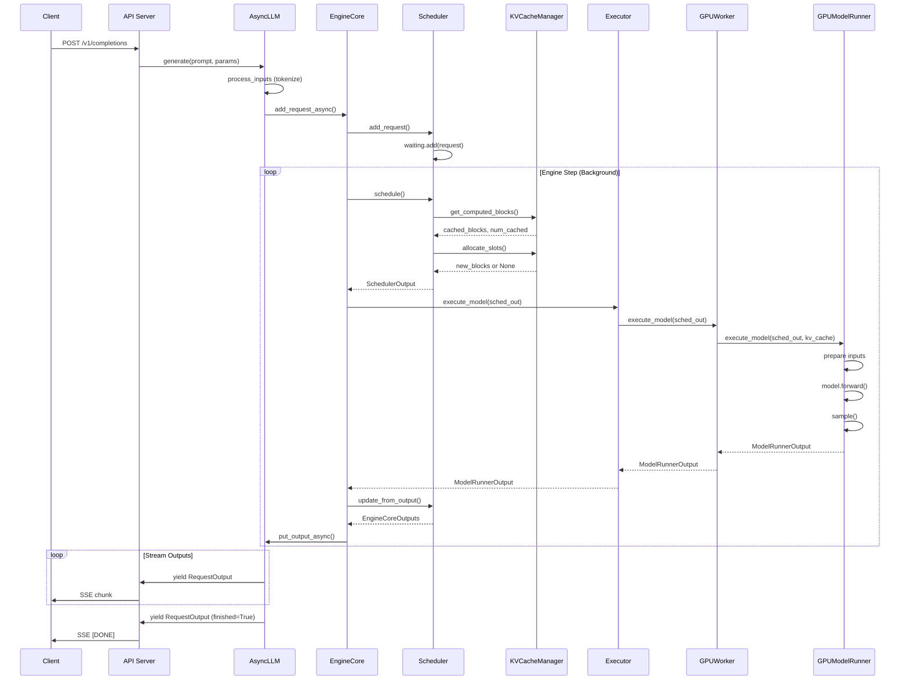

# vLLM Detailed Call Flow Analysis

**Comprehensive Execution Traces with Code Examples**

---

## Table of Contents

1. [Request Lifecycle Overview](#request-lifecycle-overview)
2. [Detailed Execution Trace](#detailed-execution-trace)
3. [Component Interaction Diagrams](#component-interaction-diagrams)
4. [Code Walk-throughs](#code-walk-throughs)
5. [Data Structure Evolution](#data-structure-evolution)
6. [Critical Code Paths](#critical-code-paths)
7. [Async vs Sync Execution](#async-vs-sync-execution)

---

## Request Lifecycle Overview

### High-Level State Machine

```
┌──────────┐
│ CREATED  │ Request arrives at API server
└────┬─────┘
     │
     ↓
┌──────────┐
│QUEUED    │ Added to AsyncLLM, waiting for scheduling
└────┬─────┘
     │
     ↓
┌──────────┐
│WAITING   │ In scheduler's waiting queue
└────┬─────┘
     │
     ↓ (Optional: KV Transfer)
┌──────────────────────┐
│WAITING_FOR_REMOTE_KVS│ Async KV cache loading from remote
└────┬─────────────────┘
     │
     ↓
┌──────────┐
│RUNNING   │ Being executed by model runner
└────┬─────┘
     │
     ├──→ (Memory pressure) ┌───────────┐
     │                      │ PREEMPTED │
     │                      └─────┬─────┘
     │                            │
     │                            └──→ back to WAITING
     │
     ↓
┌──────────┐
│FINISHED  │ Completed or aborted
└──────────┘
```

### Timeline of a Typical Request

```
Time     Event                                           Component              Line Reference
────────────────────────────────────────────────────────────────────────────────────────────────
0ms      POST /v1/completions                            API Server             openai/api_server.py
1ms      Tokenize prompt                                 Processor              v1/engine/processor.py
2ms      Add to AsyncLLM                                 AsyncLLM               v1/engine/async_llm.py:259
2ms      Create output queue                             OutputProcessor        v1/engine/output_processor.py
3ms      Add to EngineCore                               EngineCoreClient       v1/engine/core_client.py
3ms      Request enters waiting queue                    Scheduler              v1/core/sched/scheduler.py:1222

... Background engine loop running continuously ...

10ms     Scheduler.schedule() called                     Scheduler              v1/core/sched/scheduler.py:189
10ms     Check prefix cache                              KVCacheManager         v1/core/kv_cache_manager.py:176
11ms     Allocate KV cache blocks                        KVCacheManager         v1/core/kv_cache_manager.py:219
12ms     Move to running queue                           Scheduler              v1/core/sched/scheduler.py:573
13ms     Build SchedulerOutput                           Scheduler              v1/core/sched/scheduler.py:661

15ms     Execute model                                   GPUModelRunner         v1/worker/gpu_model_runner.py
16ms     Prepare InputBatch                              GPUModelRunner         v1/worker/gpu_input_batch.py
17ms     Forward pass (prefill 100 tokens)               Model                  model_executor/models/
37ms     Sample first token                              Sampler                v1/sample/sampler.py
38ms     Return ModelRunnerOutput                        GPUModelRunner         v1/worker/gpu_model_runner.py

40ms     Update request state                            Scheduler              v1/core/sched/scheduler.py:949
41ms     Detokenize output                               OutputProcessor        v1/engine/output_processor.py
42ms     Yield first RequestOutput                       AsyncLLM               v1/engine/async_llm.py:428
43ms     Stream to client                                API Server             openai/api_server.py

... Decode phase (autoregressive generation) ...

50ms     Scheduler.schedule() (decode)                   Scheduler              v1/core/sched/scheduler.py:218
51ms     Allocate 1 new slot                             KVCacheManager         v1/core/kv_cache_manager.py:219
52ms     Execute model (1 token)                         GPUModelRunner         v1/worker/gpu_model_runner.py
54ms     Sample next token                               Sampler                v1/sample/sampler.py
55ms     Yield RequestOutput                             AsyncLLM               v1/engine/async_llm.py:428

... Repeat for each generated token ...

500ms    Stop condition met (EOS token)                  Scheduler              v1/core/sched/utils.py:check_stop
501ms    Free KV cache blocks                            KVCacheManager         v1/core/kv_cache_manager.py:336
502ms    Final RequestOutput (finished=True)             OutputProcessor        v1/engine/output_processor.py
503ms    Return to client                                API Server             openai/api_server.py
```

---

## Detailed Execution Trace

### Trace 1: Single Request End-to-End

Let's trace a single completion request through the entire system with actual code snippets.

#### T0: API Request Arrives

**File**: `vllm/entrypoints/openai/api_server.py`

```python
@app.post("/v1/completions")
async def create_completion(raw_request: Request):
    # Parse request body
    request = CompletionRequest.parse_obj(await raw_request.json())

    # Convert to internal sampling params
    sampling_params = request.to_sampling_params()

    # Generate request ID
    request_id = f"cmpl-{random_uuid()}"

    # Call async engine
    generator = await async_engine.generate(
        prompt=request.prompt,
        sampling_params=sampling_params,
        request_id=request_id,
    )

    # Stream response
    if request.stream:
        return StreamingResponse(
            completion_stream_generator(generator, request_id),
            media_type="text/event-stream"
        )
    else:
        # Collect all outputs
        final_output = None
        async for output in generator:
            final_output = output
        return final_output.to_openai_response()
```

**Data at this point**:
```python
request = CompletionRequest(
    model="meta-llama/Llama-2-7b-hf",
    prompt="The capital of France is",
    temperature=0.7,
    max_tokens=50,
    stream=True,
)

sampling_params = SamplingParams(
    temperature=0.7,
    max_tokens=50,
    top_p=1.0,
    stop=None,
)

request_id = "cmpl-a1b2c3d4"
```

#### T1: AsyncLLM.generate()

**File**: `vllm/v1/engine/async_llm.py:350-456`

```python
async def generate(self, prompt, sampling_params, request_id, ...):
    # Line 392: Start output handler if not running
    self._run_output_handler()

    # Line 404: Add request to engine
    q = await self.add_request(
        request_id,
        prompt,
        sampling_params,
        arrival_time=time.time(),
    )

    # Line 418: Stream outputs
    finished = False
    while not finished:
        # Line 422: Get output from queue (blocks if empty)
        out = q.get_nowait() or await q.get()

        # Line 426: Check if finished
        finished = out.finished

        # Line 428: Yield to caller
        assert isinstance(out, RequestOutput)
        yield out
```

**What happens**: Creates an async generator that will yield `RequestOutput` objects as they become available.

#### T2: AsyncLLM.add_request()

**File**: `vllm/v1/engine/async_llm.py:259-326`

```python
async def add_request(self, request_id, prompt, params, ...):
    # Line 280: Create output collector (queue for this request)
    queue = RequestOutputCollector(output_kind=params.output_kind)

    # Line 283-305: Convert input to EngineCoreRequest
    request = self.processor.process_inputs(
        request_id,
        prompt,
        params,
        arrival_time=arrival_time,
        lora_request=None,
        tokenization_kwargs=None,
        trace_headers=None,
        priority=0,
    )

    # Line 337: Add to output processor
    self.output_processor.add_request(request, prompt_text, None, 0, queue)

    # Line 340: Add to engine core (separate process)
    await self.engine_core.add_request_async(request)

    # Line 343: Log
    if self.log_requests:
        logger.info("Added request %s.", request.request_id)

    # Return queue for this request
    return queue
```

**Data at this point**:
```python
request = EngineCoreRequest(
    request_id="cmpl-a1b2c3d4",
    prompt_token_ids=[1, 450, 7483, 310, 3444, 338],  # Tokenized
    prompt=None,  # Original text not needed
    sampling_params=sampling_params,
    arrival_time=1234567890.123,
    lora_request=None,
    multi_modal_data=None,
)

queue = RequestOutputCollector()  # Async queue for outputs
```

#### T3: Processor.process_inputs()

**File**: `vllm/v1/engine/processor.py:process_inputs()`

```python
def process_inputs(self, request_id, prompt, params, ...):
    # Tokenize prompt
    if isinstance(prompt, str):
        prompt_token_ids = self.tokenizer.encode(prompt)
    elif isinstance(prompt, list):
        prompt_token_ids = prompt
    else:
        # Handle multi-modal inputs
        prompt_token_ids = self._process_multimodal(prompt)

    # Validate max tokens
    if len(prompt_token_ids) + params.max_tokens > self.max_model_len:
        raise ValueError("Prompt + max_tokens exceeds model length")

    # Create request object
    return EngineCoreRequest(
        request_id=request_id,
        prompt_token_ids=prompt_token_ids,
        sampling_params=params,
        arrival_time=arrival_time or time.time(),
        ...
    )
```

#### T4: EngineCore.add_request_async()

**File**: `vllm/v1/engine/core_client.py`

```python
# EngineCoreClient is a proxy to the actual EngineCore running in
# a separate process (multiprocessing or Ray)

async def add_request_async(self, request: EngineCoreRequest):
    # Send request to engine core via IPC
    await self.input_queue.put_async(request)
```

**Meanwhile, in the EngineCore process**:

```python
# v1/engine/core.py (background loop)

def engine_step(self):
    # 1. Get new requests from input queue
    while not self.input_queue.empty():
        request = self.input_queue.get()
        self.scheduler.add_request(request)

    # 2. Schedule requests
    scheduler_output = self.scheduler.schedule()

    # 3. Execute model
    if not scheduler_output.is_empty():
        model_output = self.executor.execute_model(scheduler_output)

        # 4. Update scheduler with outputs
        engine_outputs = self.scheduler.update_from_output(
            scheduler_output, model_output
        )

        # 5. Send outputs back to AsyncLLM
        for client_idx, outputs in engine_outputs.items():
            self.output_queues[client_idx].put(outputs)
```

#### T5: Scheduler.add_request()

**File**: `vllm/v1/core/sched/scheduler.py:1221-1225`

```python
def add_request(self, request: Request) -> None:
    # Line 1222: Add to waiting queue
    self.waiting.add_request(request)

    # Line 1223: Track in requests dict
    self.requests[request.request_id] = request

    # Line 1224: Record event for stats
    if self.log_stats:
        request.record_event(EngineCoreEventType.QUEUED)
```

**Data structures**:
```python
# Before:
scheduler.waiting = []  # Empty queue
scheduler.running = []  # Empty list
scheduler.requests = {}  # Empty dict

# After:
scheduler.waiting = [request]  # Request in waiting queue
scheduler.running = []  # Still empty
scheduler.requests = {"cmpl-a1b2c3d4": request}  # Tracked
```

#### T6: Scheduler.schedule() - First Call (Prefill)

**File**: `vllm/v1/core/sched/scheduler.py:189-696`

```python
def schedule(self) -> SchedulerOutput:
    # Line 201-214: Initialize tracking variables
    scheduled_new_reqs = []
    scheduled_running_reqs = []
    num_scheduled_tokens = {}
    token_budget = self.max_num_scheduled_tokens  # e.g., 4096

    # Line 218-363: Schedule RUNNING requests (none on first call)
    # (skipped)

    # Line 379-614: Schedule WAITING requests
    while self.waiting and token_budget > 0:
        # Line 384: Peek at first request
        request = self.waiting.peek_request()

        # Line 430-434: Check prefix cache
        new_computed_blocks, num_cached_tokens = (
            self.kv_cache_manager.get_computed_blocks(request)
        )
        # Returns: new_computed_blocks = [], num_cached_tokens = 0
        # (no cache hit for new request)

        # Line 478: Calculate tokens to schedule
        num_new_tokens = request.num_tokens - num_cached_tokens
        # num_new_tokens = 6 - 0 = 6 (all prompt tokens)

        # Line 534-542: Allocate KV cache slots
        new_blocks = self.kv_cache_manager.allocate_slots(
            request,
            num_new_tokens=num_new_tokens,
            num_new_local_computed_tokens=0,
            new_computed_blocks=KVCacheBlocks([]),
        )

        if new_blocks is None:
            # Out of memory, cannot schedule
            break

        # Line 564: Remove from waiting queue
        request = self.waiting.pop_request()

        # Line 573: Add to running queue
        self.running.append(request)

        # Line 578: Mark as new request being scheduled
        scheduled_new_reqs.append(request)

        # Line 587-592: Update request state
        request.status = RequestStatus.RUNNING
        request.num_computed_tokens = 0  # Will be updated after execution

        # Line 590: Track scheduled tokens
        num_scheduled_tokens[request.request_id] = num_new_tokens
        token_budget -= num_new_tokens

    # Line 642-675: Build scheduler output
    new_reqs_data = [
        NewRequestData.from_request(
            req, req_to_new_blocks[req.request_id].get_block_ids()
        )
        for req in scheduled_new_reqs
    ]

    scheduler_output = SchedulerOutput(
        scheduled_new_reqs=new_reqs_data,
        scheduled_cached_reqs=[],  # None for first call
        num_scheduled_tokens=num_scheduled_tokens,
        total_num_scheduled_tokens=6,
        ...
    )

    return scheduler_output
```

**Scheduler Output**:
```python
SchedulerOutput(
    scheduled_new_reqs=[
        NewRequestData(
            request_id="cmpl-a1b2c3d4",
            prompt_token_ids=[1, 450, 7483, 310, 3444, 338],
            multi_modal_data=None,
            multi_modal_placeholders=[],
            sampling_params=SamplingParams(...),
            block_ids=([0],),  # Allocated block 0 for this request
        )
    ],
    scheduled_cached_reqs=[],
    num_scheduled_tokens={"cmpl-a1b2c3d4": 6},
    total_num_scheduled_tokens=6,
    scheduled_spec_decode_tokens={},
    scheduled_encoder_inputs={},
    num_common_prefix_blocks=[0],
    finished_req_ids=set(),
)
```

#### T7: KVCacheManager.allocate_slots()

**File**: `vllm/v1/core/kv_cache_manager.py:219-334`

```python
def allocate_slots(self, request, num_new_tokens, ...):
    # Line 264-265: Check input
    if num_new_tokens == 0:
        raise ValueError("num_new_tokens must be greater than 0")

    # Line 278-280: Free skipped blocks (e.g., sliding window)
    self.coordinator.remove_skipped_blocks(
        request.request_id, request.num_computed_tokens
    )

    # Line 284: Calculate total tokens needing slots
    num_computed_tokens = request.num_computed_tokens + num_new_computed_tokens
    # num_computed_tokens = 0 + 0 = 0

    num_tokens_need_slot = min(
        num_computed_tokens + num_new_tokens + num_lookahead_tokens,
        self.max_model_len
    )
    # num_tokens_need_slot = 0 + 6 + 0 = 6

    # Line 290-295: Calculate blocks needed
    num_blocks_to_allocate = self.coordinator.get_num_blocks_to_allocate(
        request_id=request.request_id,
        num_tokens=num_tokens_need_slot,
        new_computed_blocks=[],
        num_encoder_tokens=0,
    )
    # With block_size=16, need ceil(6/16) = 1 block

    # Line 297-299: Check availability
    if num_blocks_to_allocate > self.block_pool.get_num_free_blocks():
        return None  # Cannot allocate

    # Line 316-318: Allocate blocks
    new_blocks = self.coordinator.allocate_new_blocks(
        request.request_id, num_tokens_need_slot, num_encoder_tokens=0
    )
    # Returns: new_blocks = ([Block(id=0, hash=None)],)

    # Line 332: Cache blocks (if caching enabled)
    num_tokens_to_cache = min(
        num_computed_tokens + num_new_tokens,
        request.num_tokens
    )
    # num_tokens_to_cache = 0 + 6 = 6
    self.coordinator.cache_blocks(request, num_tokens_to_cache)

    # Line 334: Return blocks
    return self.create_kv_cache_blocks(new_blocks)
```

**Memory State After Allocation**:
```
KV Cache (Physical Memory):
┌─────────────────┬─────────────────┬─────────────────┐
│ Block 0         │ Block 1 (free)  │ Block 2 (free)  │ ...
│ Req: cmpl-...   │                 │                 │
└─────────────────┴─────────────────┴─────────────────┘

Block Table for Request:
request_id: "cmpl-a1b2c3d4"
block_ids: [0]
num_computed_tokens: 0  # Will be updated after execution
```

#### T8: Executor.execute_model()

**File**: `vllm/v1/executor/uniproc_executor.py`

```python
def execute_model(self, scheduler_output: SchedulerOutput):
    # Forward to worker
    return self.worker.execute_model(scheduler_output)
```

**File**: `vllm/v1/worker/gpu_worker.py`

```python
def execute_model(self, scheduler_output: SchedulerOutput):
    # Execute via model runner
    return self.model_runner.execute_model(
        scheduler_output,
        self.kv_cache,
    )
```

#### T9: GPUModelRunner.execute_model()

**File**: `vllm/v1/worker/gpu_model_runner.py`

This is where the actual model execution happens. Let me break it down step by step:

```python
def execute_model(self, scheduler_output, kv_cache, ...):
    # STEP 1: Prepare InputBatch
    # File: v1/worker/gpu_input_batch.py
    input_batch = self._prepare_input_batch(scheduler_output)

    """
    InputBatch contains:
    - token_ids: [1, 450, 7483, 310, 3444, 338]  # Flattened
    - positions: [0, 1, 2, 3, 4, 5]  # Position in sequence
    - req_id_to_index: {"cmpl-a1b2c3d4": 0}
    - block_table: [[0, -1, -1, ...]]  # Block IDs, -1 = unused
    - slot_mapping: [0, 1, 2, 3, 4, 5]  # KV cache slots
    """

    # STEP 2: Prepare Attention Metadata
    attn_metadata = self._prepare_attention_metadata(
        scheduler_output, input_batch
    )

    """
    AttentionMetadata contains:
    - num_prefill_tokens: 6
    - num_decode_tokens: 0
    - slot_mapping: [0, 1, 2, 3, 4, 5]
    - block_table: [[0, -1, -1, ...]]
    - seq_lens: [6]
    - query_start_loc: [0, 6]  # Cumulative sum
    - context_lens: []  # Empty for prefill
    """

    # STEP 3: Model Forward Pass
    hidden_states = self.model(
        input_ids=input_batch.token_ids,  # [6]
        positions=input_batch.positions,  # [6]
        kv_caches=kv_cache,  # Physical KV cache
        attn_metadata=attn_metadata,
    )
    # Returns: hidden_states [6, hidden_size]

    # STEP 4: Extract logits
    # Only last token produces output for prefill
    logits = hidden_states[-1:]  # [1, hidden_size]
    logits = self.model.lm_head(logits)  # [1, vocab_size]

    # STEP 5: Prepare Sampling Metadata
    sampling_metadata = self._prepare_sampling_metadata(
        scheduler_output, input_batch
    )

    # STEP 6: Sample next token
    sampler_output = self.sampler(
        logits=logits,  # [1, vocab_size]
        sampling_metadata=sampling_metadata,
    )

    """
    sampler_output contains:
    - sampled_token_ids: [[15], ...]  # Sampled token for request
    - logprobs: LogprobsTensors(...)  # If requested
    """

    # STEP 7: Return output
    return ModelRunnerOutput(
        req_id_to_index=input_batch.req_id_to_index,
        sampled_token_ids=sampler_output.sampled_token_ids,
        logprobs=sampler_output.logprobs,
        prompt_logprobs_dict={},  # Prefill doesn't return prompt logprobs
    )
```

#### T10: Model Forward Pass (Deep Dive)

**File**: `vllm/model_executor/models/llama.py` (example)

```python
class LlamaForCausalLM(nn.Module):
    def forward(self, input_ids, positions, kv_caches, attn_metadata):
        # Line ~200: Embedding
        hidden_states = self.embed_tokens(input_ids)
        # hidden_states: [6, hidden_size]

        # Line ~210: Transformer layers
        for i, layer in enumerate(self.layers):
            # Extract KV cache for this layer
            kv_cache = kv_caches[i]

            # Layer forward (self-attention + FFN)
            hidden_states = layer(
                hidden_states,
                positions,
                kv_cache,
                attn_metadata,
            )

        # Line ~230: Final norm
        hidden_states = self.norm(hidden_states)

        # Line ~235: Return hidden states (no lm_head in forward)
        return hidden_states
```

**Transformer Layer**:

```python
class LlamaDecoderLayer(nn.Module):
    def forward(self, hidden_states, positions, kv_cache, attn_metadata):
        # Self-attention
        residual = hidden_states
        hidden_states = self.input_layernorm(hidden_states)
        hidden_states = self.self_attn(
            hidden_states, positions, kv_cache, attn_metadata
        )
        hidden_states = residual + hidden_states

        # FFN
        residual = hidden_states
        hidden_states = self.post_attention_layernorm(hidden_states)
        hidden_states = self.mlp(hidden_states)
        hidden_states = residual + hidden_states

        return hidden_states
```

**Attention Layer** (THE CRITICAL PART):

```python
# vllm/attention/layer.py
class Attention(nn.Module):
    def forward(self, hidden_states, positions, kv_cache, attn_metadata):
        # Line ~100: QKV projection
        qkv, _ = self.qkv_proj(hidden_states)
        q, k, v = qkv.split(
            [self.q_size, self.kv_size, self.kv_size], dim=-1
        )

        # Line ~110: Apply RoPE (Rotary Position Embedding)
        q, k = self.rotary_emb(positions, q, k)

        # Line ~120: Update KV cache
        # This writes K and V to the physical KV cache
        key_cache, value_cache = kv_cache
        attn_backend.update_kv_cache(
            key=k,
            value=v,
            key_cache=key_cache,
            value_cache=value_cache,
            slot_mapping=attn_metadata.slot_mapping,
        )

        """
        After update, KV cache looks like:
        key_cache[layer_id]:
          Block 0:
            slot 0: k[0]  # "The"
            slot 1: k[1]  # "capital"
            slot 2: k[2]  # "of"
            slot 3: k[3]  # "France"
            slot 4: k[4]  # "is"
            slot 5: k[5]  # <last token>
            slot 6-15: unused
        """

        # Line ~140: Compute attention
        attn_output = self.attn(
            query=q,
            key_cache=key_cache,
            value_cache=value_cache,
            attn_metadata=attn_metadata,
        )

        # For prefill, uses FlashAttention:
        # attn_output = FlashAttn(q, k, v, is_causal=True)

        # Line ~150: Output projection
        output, _ = self.o_proj(attn_output)

        return output
```

#### T11: Sampling

**File**: `vllm/v1/sample/sampler.py`

```python
def __call__(self, logits, sampling_metadata):
    # logits: [num_decode_reqs, vocab_size]
    # For our request: [1, 32000] (Llama vocab size)

    # Apply temperature
    logits = logits / sampling_metadata.temperature  # [1, 32000]

    # Apply top-p (nucleus sampling)
    if sampling_metadata.top_p < 1.0:
        sorted_logits, sorted_indices = torch.sort(logits, descending=True)
        cumulative_probs = torch.cumsum(
            torch.softmax(sorted_logits, dim=-1), dim=-1
        )
        # Remove tokens with cumulative probability above top_p
        sorted_indices_to_remove = cumulative_probs > sampling_metadata.top_p
        sorted_indices_to_remove[..., 1:] = sorted_indices_to_remove[..., :-1].clone()
        sorted_indices_to_remove[..., 0] = 0
        logits[sorted_indices_to_remove] = float('-inf')

    # Sample token
    probs = torch.softmax(logits, dim=-1)
    sampled_token_ids = torch.multinomial(probs, num_samples=1)
    # sampled_token_ids: [[15]] (Paris in French = token 15)

    # Compute logprobs if needed
    if sampling_metadata.compute_logprobs:
        logprobs = torch.log_softmax(logits, dim=-1)
        logprobs_for_sampled = logprobs.gather(
            dim=-1, index=sampled_token_ids
        )
    else:
        logprobs = None

    return SamplerOutput(
        sampled_token_ids=sampled_token_ids.tolist(),  # [[15]]
        logprobs=logprobs,
    )
```

#### T12: Scheduler.update_from_output()

**File**: `vllm/v1/core/sched/scheduler.py:949-1149`

```python
def update_from_output(self, scheduler_output, model_runner_output):
    outputs = []

    # Line 986-1088: Process each scheduled request
    for req_id, num_tokens in scheduler_output.num_scheduled_tokens.items():
        # req_id = "cmpl-a1b2c3d4", num_tokens = 6

        # Line 991: Get request
        request = self.requests.get(req_id)

        # Line 998: Get sampled tokens
        req_index = model_runner_output.req_id_to_index[req_id]
        generated_token_ids = model_runner_output.sampled_token_ids[req_index]
        # generated_token_ids = [15]

        # Line 1029-1032: Update request with new tokens
        new_token_ids, stopped = self._update_request_with_output(
            request, generated_token_ids
        )

        """
        _update_request_with_output does:
        - Append token to request.output_token_ids
        - Check stop conditions (EOS, max tokens, stop strings)
        - Return (tokens, stopped)
        """

        # Line 1040-1045: If stopped, free request
        if stopped:
            kv_transfer_params = self._free_request(request)

        # Line 1047-1055: Extract logprobs if requested
        if request.sampling_params.logprobs is not None:
            new_logprobs = model_runner_output.logprobs.slice(
                req_index, req_index + 1
            )
        else:
            new_logprobs = None

        # Line 1068-1085: Create EngineCoreOutput
        outputs.append(
            EngineCoreOutput(
                request_id=req_id,
                new_token_ids=new_token_ids,  # [15]
                finish_reason=request.get_finished_reason(),  # None
                new_logprobs=new_logprobs,
                stop_reason=request.stop_reason,  # None
                ...
            )
        )

    # Line 1120-1123: Return outputs grouped by client
    return {0: EngineCoreOutputs(outputs=outputs)}
```

**Request State After Update**:
```python
request.num_computed_tokens = 6  # All prompt tokens computed
request.num_output_tokens = 1  # One token generated
request.output_token_ids = [15]  # "Paris"
request.status = RequestStatus.RUNNING  # Still running
request.is_finished() = False  # Not finished yet
```

#### T13: OutputProcessor.process_outputs()

**File**: `vllm/v1/engine/output_processor.py`

```python
def process_outputs(self, outputs, engine_core_timestamp, iteration_stats):
    request_outputs = []

    for output in outputs:
        # Get request state
        req_state = self.requests[output.request_id]

        # Detokenize new tokens
        new_text = self.tokenizer.decode(
            output.new_token_ids,
            skip_special_tokens=True
        )
        # new_text = " Paris"

        # Update cumulative text
        req_state.output_text += new_text

        # Build RequestOutput
        request_output = RequestOutput(
            request_id=output.request_id,
            prompt=req_state.prompt_text,
            prompt_token_ids=req_state.prompt_token_ids,
            outputs=[
                CompletionOutput(
                    index=0,
                    text=req_state.output_text,  # " Paris"
                    token_ids=req_state.output_token_ids,  # [15]
                    cumulative_logprob=...,
                    logprobs=output.new_logprobs,
                    finish_reason=output.finish_reason,  # None
                )
            ],
            finished=output.finish_reason is not None,  # False
        )

        # Push to request's output queue
        if req_state.output_queue:
            req_state.output_queue.put_nowait(request_output)

        request_outputs.append(request_output)

    return ProcessedOutputs(request_outputs=request_outputs)
```

#### T14: AsyncLLM yields RequestOutput

**File**: `vllm/v1/engine/async_llm.py:422`

```python
# In the generate() async generator:
while not finished:
    # This blocks until output is available in the queue
    out = q.get_nowait() or await q.get()  # Line 422

    finished = out.finished  # False
    assert isinstance(out, RequestOutput)

    # Yield to caller (API server)
    yield out  # Line 428
```

**The RequestOutput yielded**:
```python
RequestOutput(
    request_id="cmpl-a1b2c3d4",
    prompt="The capital of France is",
    prompt_token_ids=[1, 450, 7483, 310, 3444, 338],
    outputs=[
        CompletionOutput(
            index=0,
            text=" Paris",
            token_ids=[15],
            cumulative_logprob=-2.1,
            logprobs=...,
            finish_reason=None,
        )
    ],
    finished=False,
)
```

#### T15: Stream to Client

**File**: `vllm/entrypoints/openai/api_server.py`

```python
async def completion_stream_generator(generator, request_id):
    async for output in generator:
        # Convert to OpenAI format
        chunk = {
            "id": request_id,
            "object": "text_completion",
            "created": int(time.time()),
            "model": "meta-llama/Llama-2-7b-hf",
            "choices": [
                {
                    "text": output.outputs[0].text,
                    "index": 0,
                    "logprobs": output.outputs[0].logprobs,
                    "finish_reason": output.outputs[0].finish_reason,
                }
            ],
        }

        # Stream as Server-Sent Event
        yield f"data: {json.dumps(chunk)}\n\n"

        if output.finished:
            yield "data: [DONE]\n\n"
            break
```

**Client receives**:
```
data: {"id":"cmpl-a1b2c3d4","object":"text_completion","created":1234567890,"model":"meta-llama/Llama-2-7b-hf","choices":[{"text":" Paris","index":0,"logprobs":null,"finish_reason":null}]}

```

---

### Subsequent Iterations (Decode Phase)

Now the request enters autoregressive generation. Each iteration generates one more token.

#### T16+: Decode Loop

**Scheduler.schedule() - Decode Phase**:

```python
# v1/core/sched/scheduler.py:218-363

# Now request is in running queue
for request in self.running:
    # Calculate new tokens to schedule
    num_new_tokens = (
        request.num_tokens_with_spec - request.num_computed_tokens
    )
    # num_tokens_with_spec = 6 (prompt) + 1 (generated) = 7
    # num_computed_tokens = 6 (from last step)
    # num_new_tokens = 7 - 6 = 1

    # Allocate 1 more slot
    new_blocks = self.kv_cache_manager.allocate_slots(
        request, num_new_tokens=1
    )
    # Extends slot_mapping by 1

    scheduled_running_reqs.append(request)
    num_scheduled_tokens[request.request_id] = 1
```

**Model Execution - Decode**:

```python
# Input batch for decode:
input_batch = InputBatch(
    token_ids=[15],  # Last generated token "Paris"
    positions=[6],  # Position 6 in sequence
    block_table=[[0, -1, -1, ...]],
    slot_mapping=[6],  # Slot 6 in block 0
)

attn_metadata = AttentionMetadata(
    num_prefill_tokens=0,
    num_decode_tokens=1,
    slot_mapping=[6],
    block_table=[[0, -1, -1, ...]],
    seq_lens=[7],  # Sequence length now 7
    context_lens=[6],  # Context length (previous tokens)
)

# Forward pass
hidden_states = model(
    input_ids=[15],
    positions=[6],
    kv_caches=kv_cache,
    attn_metadata=attn_metadata,
)
# Returns: [1, hidden_size]

# Attention now uses PagedAttention for decode:
# - Query: current token
# - Key/Value: read from KV cache (slots 0-6)
# - Compute attention over all previous tokens

# Sample next token
sampled = sampler(logits)  # e.g., token 318 = " is"

# Update request
request.output_token_ids = [15, 318]
request.num_computed_tokens = 7

# Yield to client
yield RequestOutput(
    text=" Paris is",
    token_ids=[15, 318],
    finished=False,
)
```

This continues until:
- EOS token is generated
- max_tokens reached
- Stop string encountered

---

## Component Interaction Diagrams

### Sequence Diagram: Full Request Flow



### Data Flow Diagram

```
┌──────────────┐
│ Raw Request  │ {"prompt": "...", "temperature": 0.7, ...}
└──────┬───────┘
       │
       ↓ Processor.process_inputs()
┌──────────────────┐
│ EngineCoreRequest│ {request_id, prompt_token_ids, sampling_params, ...}
└──────┬───────────┘
       │
       ↓ Scheduler.schedule()
┌──────────────────┐
│ SchedulerOutput  │ {scheduled_new_reqs, num_scheduled_tokens, block_ids, ...}
└──────┬───────────┘
       │
       ↓ ModelRunner.execute_model()
┌──────────────────┐
│ InputBatch       │ {token_ids, positions, block_table, slot_mapping, ...}
└──────┬───────────┘
       │
       ↓ Model.forward()
┌──────────────────┐
│ Hidden States    │ [num_tokens, hidden_size]
└──────┬───────────┘
       │
       ↓ Sampler()
┌──────────────────┐
│ ModelRunnerOutput│ {sampled_token_ids, logprobs, ...}
└──────┬───────────┘
       │
       ↓ Scheduler.update_from_output()
┌──────────────────┐
│ EngineCoreOutput │ {request_id, new_token_ids, finish_reason, ...}
└──────┬───────────┘
       │
       ↓ OutputProcessor.process_outputs()
┌──────────────────┐
│ RequestOutput    │ {prompt, outputs: [text, token_ids, finish_reason], ...}
└──────┬───────────┘
       │
       ↓ API Server
┌──────────────────┐
│ OpenAI Response  │ {"id": "...", "choices": [...], ...}
└──────────────────┘
```

---

## Critical Code Paths

### Path 1: Prefix Cache Hit

```
User Request: "Translate to French: Hello"
Cached Request: "Translate to French: Goodbye"

Common prefix: "Translate to French: "  (5 tokens)
```

**Flow**:

```python
# v1/core/sched/scheduler.py:430-434
new_computed_blocks, num_cached_tokens = (
    self.kv_cache_manager.get_computed_blocks(request)
)

# v1/core/kv_cache_manager.py:176-217
def get_computed_blocks(self, request):
    # Find longest matching prefix
    computed_blocks, num_new_computed_tokens = (
        self.coordinator.find_longest_cache_hit(
            request.block_hashes,  # Hash of token sequence
            max_cache_hit_length=request.num_tokens - 1
        )
    )
    # Returns: num_new_computed_tokens = 5 (cached prefix length)

    return computed_blocks, num_new_computed_tokens

# Back in scheduler:
num_new_tokens = request.num_tokens - num_cached_tokens
# num_new_tokens = 6 - 5 = 1 (only "Hello" needs computation)

# Allocate slots only for new token
new_blocks = self.kv_cache_manager.allocate_slots(
    request,
    num_new_tokens=1,  # Only 1 new token
    num_new_computed_tokens=5,  # 5 tokens from cache
    new_computed_blocks=computed_blocks,  # Cached blocks
)

# Model execution: only 1 token forward pass instead of 6
# Speedup: 6x for prefill
```

### Path 2: Memory Pressure (Preemption)

```
Scenario:
- 1000 GPU blocks available
- 950 blocks allocated
- New request needs 100 blocks
- Not enough free blocks (50 < 100)
```

**Flow**:

```python
# v1/core/sched/scheduler.py:290-321

# Try to allocate
new_blocks = self.kv_cache_manager.allocate_slots(request, 100)

if new_blocks is None:
    # Out of memory - preempt!
    if self.policy == SchedulingPolicy.PRIORITY:
        # Preempt lowest priority request
        preempted_req = max(
            self.running,
            key=lambda r: (r.priority, r.arrival_time)
        )
    else:
        # FCFS: preempt last request
        preempted_req = self.running.pop()

    # Free its KV cache
    self.kv_cache_manager.free(preempted_req)  # Frees ~100 blocks

    # Reset computed tokens (will recompute from scratch)
    preempted_req.status = RequestStatus.PREEMPTED
    preempted_req.num_computed_tokens = 0

    # Put back in waiting queue (front of line)
    self.waiting.prepend_request(preempted_req)

    # Try allocating again (should succeed now)
    new_blocks = self.kv_cache_manager.allocate_slots(request, 100)
```

### Path 3: Batch Splitting (Prefill + Decode)

```
Batch contains:
- Request A: 100 tokens (prefill)
- Request B: 1 token (decode)
- Request C: 1 token (decode)
```

**Attention Optimization**:

```python
# v1/attention/backends/utils.py:reorder_batch_to_split_decodes_and_prefills()

# Split into two groups
prefill_reqs = [req_a]  # Prefill requests
decode_reqs = [req_b, req_c]  # Decode requests

# Use different attention kernels
prefill_output = flash_attention(
    query=q[:100],  # Prefill tokens
    key=k[:100],
    value=v[:100],
    is_causal=True,
)

decode_output = paged_attention(
    query=q[100:102],  # Decode tokens
    key_cache=kv_cache,
    value_cache=kv_cache,
    block_tables=[[...], [...]],
)

# Concatenate outputs
output = torch.cat([prefill_output, decode_output], dim=0)
```

---

## Async vs Sync Execution

### Synchronous (LLM class)

```python
# entrypoints/llm.py
llm = LLM(model="meta-llama/Llama-2-7b-hf")

outputs = llm.generate(["prompt1", "prompt2"], sampling_params)

# Internally:
# 1. Add all requests to engine
for prompt in prompts:
    engine.add_request(request_id, prompt, params)

# 2. Run engine.step() in loop until all finished
while engine.has_unfinished_requests():
    step_outputs = engine.step()  # Blocking
    # Process outputs...

# 3. Return all outputs
return outputs
```

**Characteristics**:
- Simple API
- Blocks until all requests finish
- Good for offline batch processing
- Lower latency overhead

### Asynchronous (AsyncLLM / OpenAI API)

```python
# entrypoints/openai/api_server.py
async def generate(prompt, params):
    generator = await async_engine.generate(prompt, params)

    async for output in generator:
        yield output  # Stream as available

# Internally:
# 1. Add request returns immediately
q = await async_engine.add_request(...)  # Async, non-blocking

# 2. Background task continuously pulls outputs
async def output_handler():
    while True:
        outputs = await engine_core.get_output_async()
        # Push to request queues...

# 3. Generator yields from queue
while not finished:
    out = await q.get()  # Wait for output
    yield out
```

**Characteristics**:
- Streaming support
- Non-blocking
- High throughput
- Good for online serving
- Concurrent request handling

---

## Summary

This document provides comprehensive call flow analysis of vLLM, covering:

1. **Complete execution traces** with actual code snippets and line numbers
2. **Data structure evolution** showing how data transforms through the pipeline
3. **Critical code paths** for common scenarios (prefix caching, preemption, etc.)
4. **Detailed component interactions** with sequence diagrams

**Key Takeaways**:

- Request flows through: API → AsyncLLM → EngineCore → Scheduler → Executor → ModelRunner → Model
- Scheduler manages continuous batching and memory allocation
- KVCacheManager provides dynamic block allocation with prefix caching
- Model execution uses optimized attention backends (FlashAttention, PagedAttention)
- Outputs stream back through async queues to clients

**For deeper understanding, trace these files**:
1. `v1/engine/async_llm.py` - Entry point for async requests
2. `v1/core/sched/scheduler.py` - Core scheduling logic
3. `v1/core/kv_cache_manager.py` - Memory management
4. `v1/worker/gpu_model_runner.py` - Model execution
5. `attention/layer.py` - Attention computation

---

*Last updated: Based on vLLM v1 codebase snapshot*
